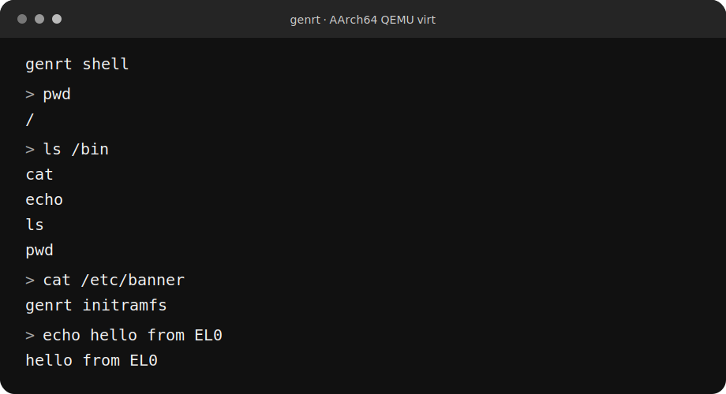

# genrt

[](https://github.com/redeemed-sis/genrt/actions/workflows/ci.yml)
[](https://github.com/redeemed-sis/genrt/releases)
[](LICENSE)

genrt is an experimental hard real-time operating system written primarily in
Rust. The active platform is single-core AArch64 QEMU `virt`; the project uses
that controlled environment to make boot, scheduling, userspace, testing, and
release invariants explicit before expanding hardware scope.

genrt is aimed at operating-system and embedded developers who want a compact,
inspectable codebase for studying deterministic kernel mechanisms. Its focus is
explicit ownership, bounded runtime structures, machine-checked QEMU contracts,
and reproducible release artifacts. It is a research and learning project, not
a production-ready or latency-certified operating system.

## Status

- High-half EL1 kernel with low-linked pre-MMU bootstrap and post-link autonomy
  verification.
- DTB-driven RAM/platform discovery, physical frame allocation, runtime TTBR1
  mappings, and a fixed bootstrap heap.
- Preemptive IRQ-return scheduler with one-shot deadlines, bounded kernel
  threads, sleep, and mailbox IPC.
- Process-owned TTBR0 address spaces, static AArch64 ELF loading, lower-EL fault
  isolation, and eager-copy `fork`/`execve`/`waitpid`.
- Readonly CPIO initramfs, bounded per-process FD tables, cwd/path traversal,
  directory iteration, and UART-backed stdin.
- Freestanding C shell and product programs declared by
  `user/c/programs.toml`.
- Declarative QEMU contracts using a test-only machine protocol rather than
  human log matching.
- Deterministic, structurally verified tagged release bundles built by `xtask`.

See [the current-state snapshot](memory/current-state.md) for implemented
details and [cross-cutting invariants](memory/invariants.md) for constraints.

## Quick start

On Arch Linux x86_64 or Ubuntu 24.04/26.04, clone the repository and run:

```bash
git clone https://github.com/redeemed-sis/genrt.git
cd genrt
./scripts/setup/install-deps.sh
cargo xtask run-aarch64
```

The default image boots the production kernel and initramfs shell. QEMU uses
the terminal as PL011 UART input; enter `ls`, `pwd`, `cat /etc/banner`,
`echo hello`, or `exit`. Use `Ctrl-c` to stop QEMU.



The image shows the current production shell after boot; the preceding kernel
diagnostic log is cropped. Commands and output are derived from the production
userspace and initramfs shipped by this repository.

For the full local verification gate, run separately:

```bash
cargo xtask ci
```

See [host dependency setup](docs/development/setup.md) for supported platforms,
manual installation, non-interactive use, and Rust migration guidance.

Useful debugging commands:

```bash
just debug-aarch64
just gdb-aarch64
```

See [AArch64 debugging](docs/development/debugging.md) for the two-terminal GDB
workflow and artifact locations.

## Build and verification

```bash
cargo xtask check
cargo xtask test-aarch64 --list
cargo xtask test-aarch64
cargo xtask ci
```

`check` runs host formatting/tests/clippy, production builds, initramfs policy,
and the `.boot.text` post-link check. `test-aarch64` runs QEMU contracts.
`ci` is the canonical local and hosted merge gate. Detailed test architecture,
artifacts, and case authoring live in [docs/testing.md](docs/testing.md).

## Releases

```bash
cargo xtask dist --tag v0.0.0-local.1 --output-dir /tmp/genrt-dist
```

The release gate tests exact production executables in controlled contract
images, verifies production composition and hashes, and emits a deterministic
bundle. See [the published releases](https://github.com/redeemed-sis/genrt/releases)
and [docs/releases.md](docs/releases.md).

## Repository layout

| Path | Responsibility |
| --- | --- |
| `arch/aarch64/` | AArch64 boot, MMU, exceptions, IRQ, timer, GIC, and UART |
| `kernel/` | Architecture-neutral kernel policy and mechanisms |
| `crates/bootinfo/` | Early boot handoff types |
| `user/` | Freestanding userspace and initramfs product data |
| `tools/xtask/` | Canonical build, QEMU, test, and release workflows |
| `tests/qemu/` | QEMU system contracts and test-only fixtures |
| `memory/` | Current state, durable invariants, and ADRs |
| `docs/` | Development, testing, release, and roadmap guides |
| `.codex/` | Project custom-agent configuration |
| `.agents/` | Repository skills and engineering standards |

## Documentation

- [Documentation map](docs/README.md)
- [AArch64 architecture](arch/aarch64/README.md)
- [Kernel architecture](kernel/README.md)
- [Memory subsystem](kernel/src/memory/README.md)
- [Scheduler and time](kernel/src/sched/README.md)
- [Filesystem and FD model](kernel/src/fs/README.md)
- [xtask workflows](tools/xtask/README.md)
- [QEMU contract tests](tests/qemu/README.md)
- [Userspace](user/README.md)
- [Project decisions](memory/decisions/README.md)
- [Agent-oriented workflow](docs/development/agent-workflow.md)

## Current boundaries

- Single-core only; no SMP locks, TLB shootdown, or latency certification.
- No FP/SIMD context ownership; kernel Rust uses the soft-float target.
- No ASIDs, copy-on-write, demand paging, signals, or recoverable usercopy
  faults.
- One main user thread per process and a deliberately small process-control ABI.
- Readonly ramfs rather than a writable VFS or storage stack.
- Raw UART stdin rather than a terminal/TTY subsystem.
- Fixed bootstrap heap and limited kernel VM mapping granularity.
- x86_64 and RISC-V ports are structural placeholders, not active targets.

Active hardening topics are tracked in
[docs/roadmap/hardening.md](docs/roadmap/hardening.md), without assigning them
calendar-based milestones.

## License

genrt is distributed under the [MIT License](LICENSE).

## Contributing

Start with [CONTRIBUTING.md](CONTRIBUTING.md). Repository engineering rules live
in [AGENTS.md](AGENTS.md) and the nearest nested instructions. Commits follow
[Conventional Commits](.agents/standards/commits.md); new or changed public and
crate-visible Rust APIs follow the [rustdoc standard](.agents/standards/rustdoc.md).
